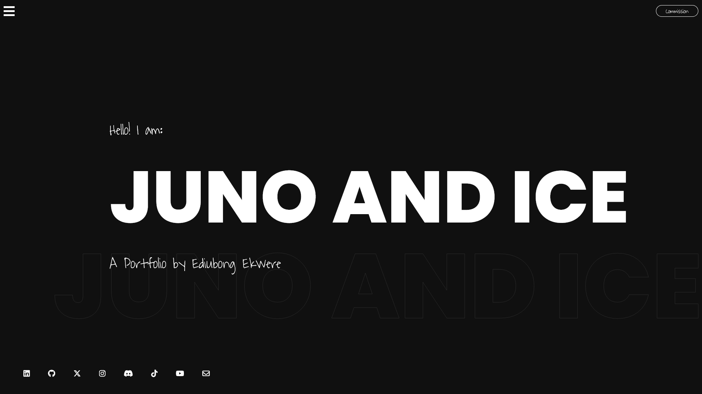

# Portfolio

Juno and Ice's Main Portfolio\
https://junoandice.github.io/Portfolio/

  
## Description
  
A horizontal scrolling portfolio that features modular web design and a clean navigable interface.
  
## Table of Contents
  
- [Installation](#installation)
- [Usage](#usage)
- [License](#license)
- [Contributing](#contributing)
- [Media](#media)
- [Credits](#credits)
  
## Installation
  
N/A

## Technologies
  
- JQuery
- universalSmoothScroll
- Font Awesome
- Google Fonts API
- JQuery ScrollTo

## Usage
  
Simply go to the gitHub pages link and view the portfolio.
  
## License
  
This project is covered under the MIT license.
  
## Contributing
  
N/A
  
## Media

## Credits

  Ediubong Ekwere | JunoAndIce\
  Cristian Davide Conte | CristianDavideConte

  <https://github.com/JunoAndIce> | [ekwere.edi@gmail.com](mailto:ekwere.edi@gmail.com)
  <https://github.com/CristianDavideConte>
